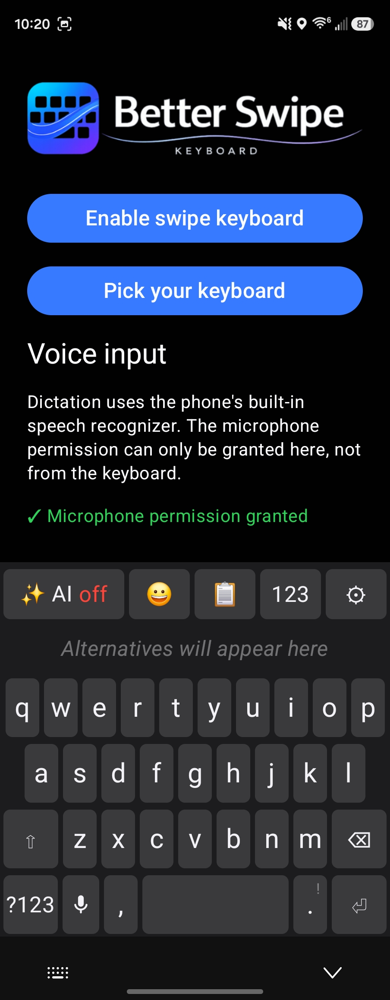
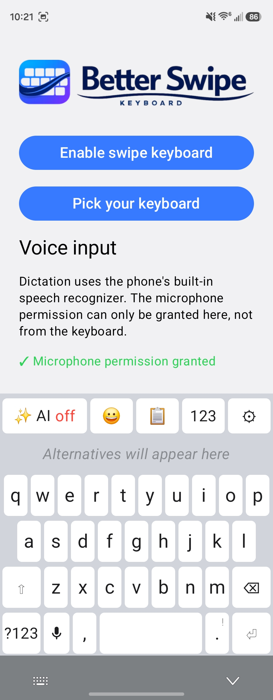
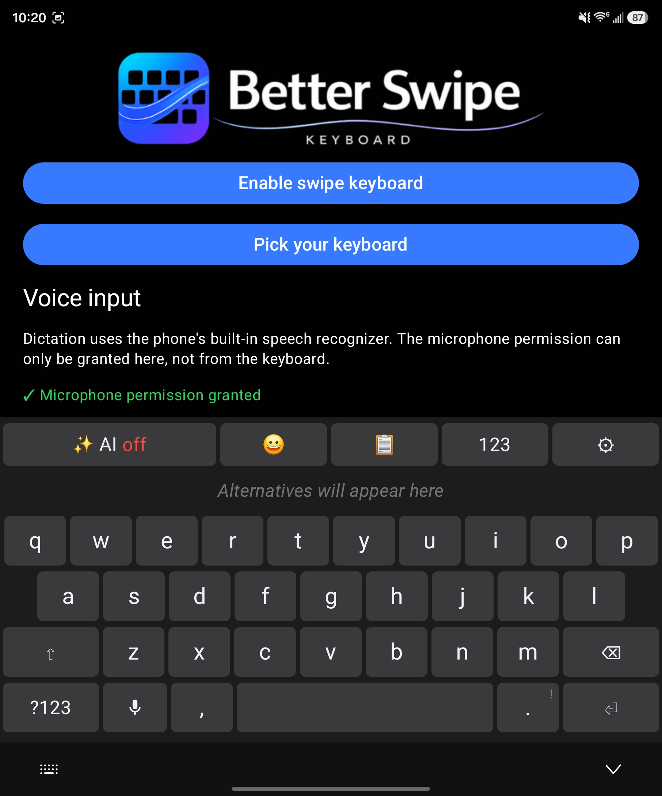
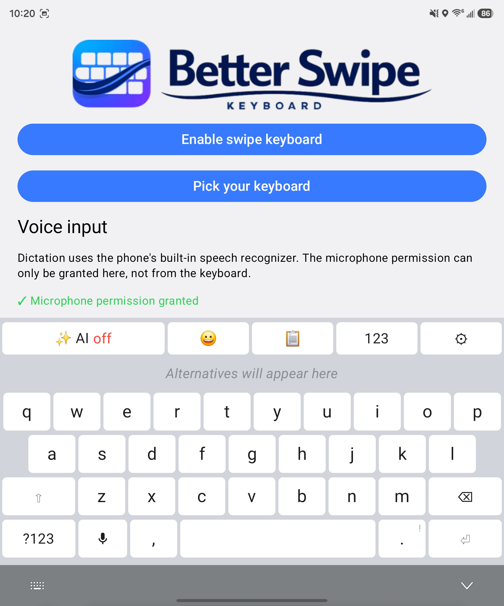

# Better Swipe Keyboard

A personal Android keyboard, written in Kotlin with Jetpack Compose.

It does the three things I wanted a keyboard to do well:

- **Swipe typing** with a custom decoder that keeps getting tuned against
  real captured finger trails.
- **Voice input** via the phone's built-in speech recognizer, with an AI
  cleanup pass afterwards.
- **AI proofreading** that fixes the current sentence after you pause —
  on-device (Gemini Nano) when possible, with a zero-data-retention cloud
  fallback.

Plus the usuals: emoji panel with suggestions, clipboard history,
space-bar cursor scrubbing, long-press punctuation, custom words.

Privacy defaults are strict: proofreading stays on-device when it can,
the clipboard history lives only in memory, and clips flagged as
sensitive (password managers) are never stored.

## Screenshots

| Dark | Light |
| --- | --- |
|  |  |
|  |  |

## Building

You need Android SDK 36 and a `local.properties` pointing at it, then:

```bash
./gradlew installDebug
```

Enable the keyboard in system settings and pick it as the active IME —
the app's setup screen has buttons for both.

## Credits

Word-frequency data from wordfreq v3 (CC BY-SA 4.0), emoji keywords from
Unicode CLDR. See `NOTICE` for full attribution. Technical details live
in `AGENTS.md` and `docs/decoder-investigation.md`.
